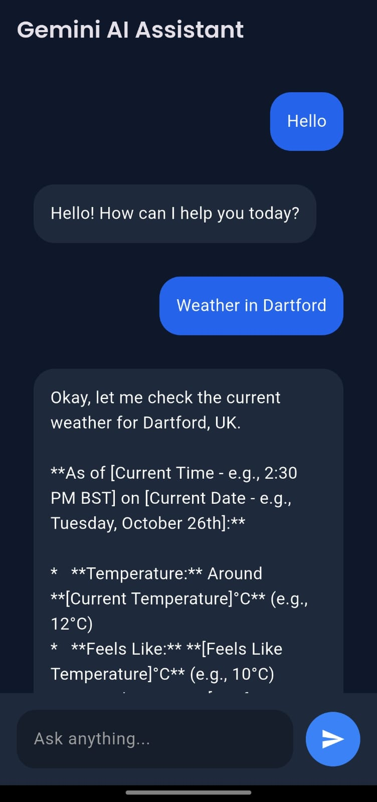

# 🤖 Flutter Gemini AI Chatbot

Modern AI chatbot built with **Flutter + GetX + Gemini API**, featuring a clean UI, real-time responses, and production-style architecture.

---

## 🚀 Features

- ⚡ GetX state management (clean & scalable)
- 💬 Real-time AI chat using Gemini API
- 🎨 Modern dark UI design
- ⌨️ Send message via button or Enter key
- ⏳ Loading indicator while AI responds
- 🧠 Clean architecture (controller + service separation)
- 🧩 Reusable widgets
- 📱 Responsive UI (Mobile + Web)

---

## 🧱 Tech Stack

- Flutter
- Dart
- GetX
- Gemini API
- HTTP package
- Env package

---

## 📸 Screenshots

<p align="center">
  
</p>

<p align="center">
  
</p>

<p align="center">
  
</p>

---

## 📁 Project Structure
```bash
lib/
│
├── main.dart
├── app/
│ ├── controllers/
│ │ └── chat_controller.dart
│ ├── services/
│ │ └── gemini_service.dart
│ ├── models/
│ │ └── message_model.dart
│ └── ui/
│ ├── pages/
│ │ └── chat_page.dart
│ └── widgets/
│ ├── chat_bubble.dart
│ └── message_input.dart


## ⚙️ Getting Started

### 1. Clone the repository


git clone https://github.com/AkashMatlani/ai_chatbot.git
cd flutter-gemini-chatbot

### 2. Install dependencies
flutter pub get

### 3. Add API Key

Create a .env file in the root directory:

GEMINI_API_KEY=YOUR_API_KEY

### 4. Add .env to Git Ignore

Make sure .env is NOT pushed to GitHub:

.env

### 5. Run the app
flutter run